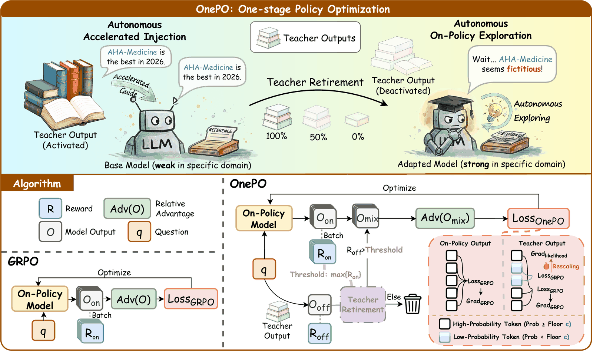

# OnePO: Direct One-stage Policy Optimization for SFT-free Domain Adaptation

<div align="center">
<h3>HuatuoGPT-3</h3>
</div>

<p align="center">
📃 <a href="https://openreview.net/pdf?id=M8eyUQldfx" target="_blank">Paper</a> ｜
🤗 <a href="https://huggingface.co/FreedomIntelligence/HuatuoGPT-3-8B" target="_blank">HuatuoGPT-3-8B</a> ｜
🤗 <a href="https://huggingface.co/FreedomIntelligence/HuatuoGPT-3-9B" target="_blank">HuatuoGPT-3-9B</a> ｜
🤗 <a href="https://huggingface.co/FreedomIntelligence/HuatuoGPT-3-32B" target="_blank">HuatuoGPT-3-32B</a> ｜
⚖️ <a href="https://huggingface.co/FreedomIntelligence/HuatuoGPT-3-Grader-8B" target="_blank">Grader</a> ｜
📚 <a href="https://huggingface.co/datasets/FreedomIntelligence/OnePO-Medical-20K" target="_blank">Data</a>
</p>

## ⚡ Introduction

Welcome to **HuatuoGPT-3**, the medical LLM series developed with [OnePO](https://openreview.net/pdf?id=M8eyUQldfx)!

**One-stage Policy Optimization (OnePO)** adapts language models to specialized domains in a single reinforcement-learning stage, without a preceding domain-specific supervised fine-tuning stage. It uses teacher responses as temporary guidance through two mechanisms:

- **Adaptive Objective Evolution** helps the model learn from low-probability teacher tokens.
- **Teacher Retirement** removes teacher guidance once the model's own responses match or exceed the teacher's reward.

<p align="center"></p>

This repository provides our medical models, OnePO training code, RL dataset, and rubric grader.

## 👨‍⚕️ Model

- **Model Access**

| Model | Backbone | Purpose | Access |
| --- | --- | --- | --- |
| **HuatuoGPT-3-8B** | Qwen3-8B-Base | Medical reasoning | [Hugging Face](https://huggingface.co/FreedomIntelligence/HuatuoGPT-3-8B) |
| **HuatuoGPT-3-9B** | Qwen3.5-9B | Medical reasoning | [Hugging Face](https://huggingface.co/FreedomIntelligence/HuatuoGPT-3-9B) |
| **HuatuoGPT-3-32B** | Qwen3-32B | Medical reasoning | [Hugging Face](https://huggingface.co/FreedomIntelligence/HuatuoGPT-3-32B) |
| **HuatuoGPT-3-Grader-8B** | Qwen3-8B | Rubric scoring | [Hugging Face](https://huggingface.co/FreedomIntelligence/HuatuoGPT-3-Grader-8B) |

- **Deploy**

**HuatuoGPT-3** can be used like [Qwen3.5](https://huggingface.co/Qwen/Qwen3.5-9B) and deployed with [vLLM](https://github.com/vllm-project/vllm) or [SGLang](https://github.com/sgl-project/sglang).

## 📚 Data

[**OnePO-Medical-20K**](https://huggingface.co/datasets/FreedomIntelligence/OnePO-Medical-20K) provides **20,338** medical RL tasks for OnePO, combining verifiable and rubric-based rewards.

| Task | Samples | Verification | Characteristics |
| --- | ---: | --- | --- |
| *Multiple-choice* | 10,191 | Exact-match answer checking | Medical reasoning with a correct option label |
| *Open-ended* | 10,147 | Rubric-based grading | Free-form responses assessed against multiple clinical criteria |

*Set `TRAIN_FILE` to `onepo_medical_20K.json` or your own training JSON.*

## 🚀 Training

- **Installation**

Prepare the GPU environment following the [installation guide](docs/training.md#environment), then install the training code:

```bash
git clone https://github.com/FreedomIntelligence/HuatuoGPT-3.git
cd HuatuoGPT-3
python -m pip install -r requirements.txt
```

- **Run OnePO**

We use [**HuatuoGPT-3-Grader-8B**](https://huggingface.co/FreedomIntelligence/HuatuoGPT-3-Grader-8B) for efficient training-time rewards: it checks multiple rubric items in one generation, reducing grading overhead and API costs.

```bash
MODEL_PATH=/path/to/student_model \
TRAIN_FILE=/path/to/OnePO-Medical-20K/onepo_medical_20K.json \
VAL_FILE=/path/to/validation.json \
REWARD_MODEL_PATH=/path/to/HuatuoGPT-3-Grader-8B \
bash OnePO.sh
```

See the [training guide](docs/training.md#start-training) for GPU settings, hyperparameters, and using an existing grader service.

## 🧐 Evaluation

Track progress during training with your own validation tasks:

- `VAL_FILE`: your validation JSON. Customize its questions and rubrics using the [task schema](docs/training.md#data-and-models).
- `TEST_FREQ=30`: evaluate every 30 optimizer steps.
- `TEST_FREQ=0 TEST_STEPS='[50,100,200]'`: evaluate at selected steps.

Rubric-based feedback comes from the configured grader. For official HealthBench results, use the [official evaluation code](https://github.com/openai/simple-evals) and the benchmark's grading protocol.

## 🩺 HuatuoGPT Series

Explore our HuatuoGPT series:

- [**HuatuoGPT**](https://github.com/FreedomIntelligence/HuatuoGPT): Taming Language Models to Be a Doctor
- [**HuatuoGPT-II**](https://github.com/FreedomIntelligence/HuatuoGPT-II): One-stage Training for Medical Adaptation of LLMs
- [**HuatuoGPT-Vision**](https://github.com/FreedomIntelligence/HuatuoGPT-Vision): Injecting Medical Visual Knowledge into Multimodal LLMs at Scale
- [**HuatuoGPT-o1**](https://github.com/FreedomIntelligence/HuatuoGPT-o1): Towards Medical Complex Reasoning with LLMs
- [**HuatuoGPT-3**](https://github.com/FreedomIntelligence/HuatuoGPT-3): OnePO: Direct One-stage Policy Optimization for SFT-free Domain Adaptation

## 📖 Citation

```bibtex
@inproceedings{chen2026onepo,
  title={OnePO: Direct One-stage Policy Optimization for SFT-free Domain Adaptation},
  author={Chen, Junying and Xie, Xinyuan and Li, Ziniu and Wang, Benyou},
  booktitle={Proceedings of the 43rd International Conference on Machine Learning},
  year={2026}
}
```
