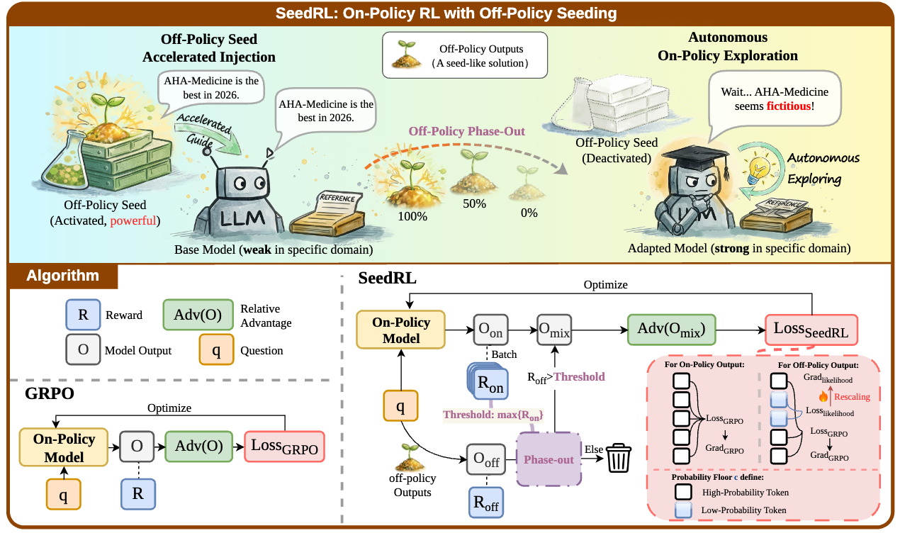

# 🩺 HuatuoGPT-3

<div align="center">
  <h3>RL-Only Domain Adaptation from Base Models via Off-Policy Seeding</h3>
</div>

<p align="center">
📃 <a href="" target="_blank">Paper</a> ｜ 🤗 <a href="https://huggingface.co/FreedomIntelligence/HuatuoGPT-3-8B" target="_blank">HuatuoGPT-3-8B</a> ｜ 🤗 <a href="https://huggingface.co/FreedomIntelligence/HuatuoGPT-3-32B" target="_blank">HuatuoGPT-3-32B</a>  
</p>
<!-- ｜ 📚 <a href="https://huggingface.co/datasets/FreedomIntelligence/HuatuoGPT-3-Data" target="_blank">Data&Code</a> -->
## ⚡ Introduction

HuatuoGPT-3 is a new open medical LLM series built with **SeedRL**, an RL-only domain adaptation paradigm. Instead of relying on the conventional two-stage pipeline (SFT then RL), SeedRL transforms a pretrained base model into a medical expert in a **single RL stage** through off-policy seeding.


<div align="center">
    
    <p><em>🌱 Overview of SeedRL.</em></p>
</div>

SeedRL injects off-policy expert outputs as transient *seeds* to rapidly bootstrap domain capabilities, then automatically phases them out as the model's own policy surpasses them. Two core mechanisms make this possible: **Off-Policy Learning Acceleration** and **Off-Policy Phase-Out**. Build on it, HuatuoGPT-3-32B achieves **70.3** on HealthBench, reaching competitive performance on the HealthBench scaling frontier.


## 👨‍⚕️ Models

We open-source the **HuatuoGPT-3** model series:

| Model | Description | Backbone | Link |
| --- | --- | --- | --- |
| **HuatuoGPT-3-8B** | 8B medical LLM trained with SeedRL | Qwen3-8B-Base | [HF Link](https://huggingface.co/FreedomIntelligence/HuatuoGPT-3-8B) |
| **HuatuoGPT-3-32B** | 32B medical LLM trained with SeedRL | Qwen3-32B | [HF Link](https://huggingface.co/FreedomIntelligence/HuatuoGPT-3-32B) |
| **HuatuoGPT-3-7B-Pangu** | 7B medical LLM trained with SeedRL | openPangu-Embedded-7B | [HF Link](https://huggingface.co/FreedomIntelligence/HuatuoGPT-3-7B-Pangu) |


## 🧪 Training Code & Data

**Coming soon.**


## 📖 Citation

If you find our work useful in your research, please cite our paper.

```bibtex
@article{huatuogpt3,
  title={HuatuoGPT-3: RL-Only Domain Adaptation from Base Models via Off-Policy Seeding},
  author={Coming soon},
  journal={arXiv preprint},
  year={2026}
}
```
